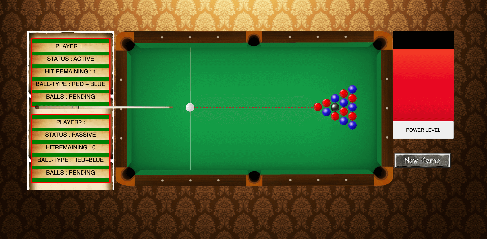
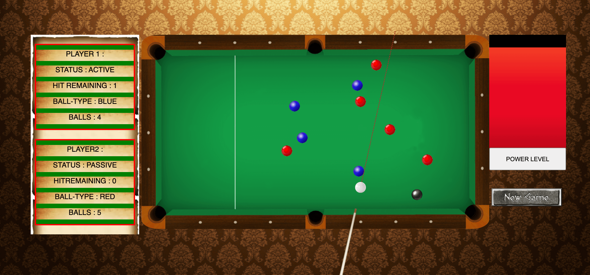

# 🎱 2D Pool - 2015
A classic 2-player 2D pool game built entirely in pure JavaScript in 2015. No external libraries—just core browser APIs!

Key Features:
Pure JavaScript Implementation: Leveraging only browser-provided APIs:
DOM Manipulation: document.getElementById, document.getElementsByClassName, document.createElement, document.getElementsByTagName
Event Handling: document.attachEvent, document.addEventListener
Timed Actions: setTimeout, clearTimeout

## Setup
Clone the Repo & open the file index.html in your browser.

## Demo
[A live Demo is available.](https://bibekshah09.github.io/javascript-pool-2015/)

## Preview

## APIs Involved
 * document.getElementById
 * document.getElementsByClassName
 * document.createElement
 * document.attachEvent
 * document.addEventListener
 * document.getElementsByTagName
 * setTimeOut
 * clearTimeOut

## Computation Based On
 * Collision detection
 * Velocity & Vector computation
 * Rotation & Reflection
 * Distance computation
 * Momentum
 * Principle of Energy Conservation

## Author
[Bibek Shah](https://github.com/BibekShah09)

## License
[MIT](https://choosealicense.com/licenses/mit/)
